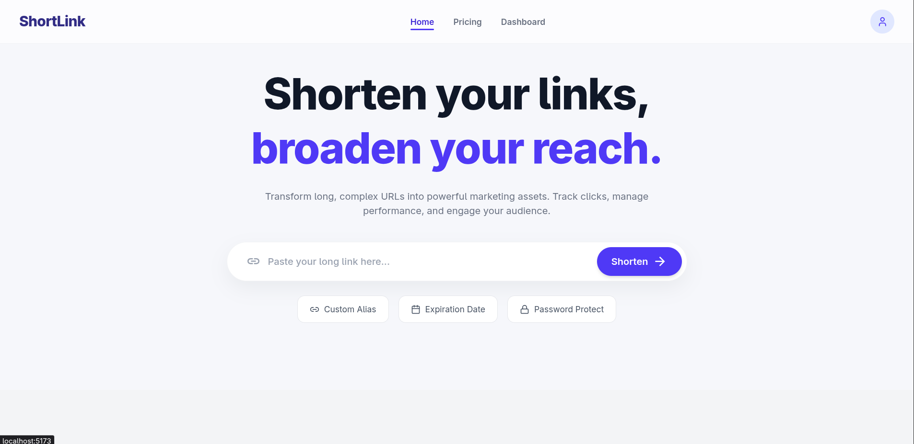
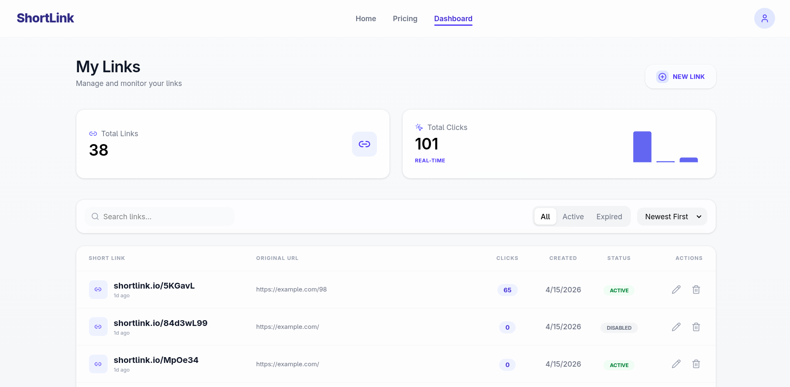
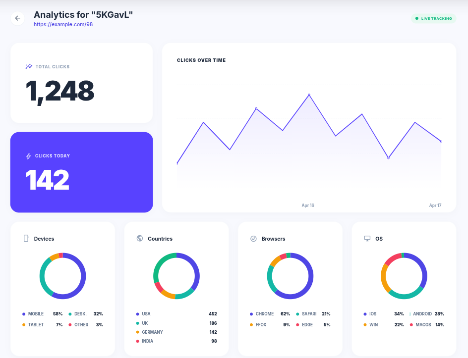
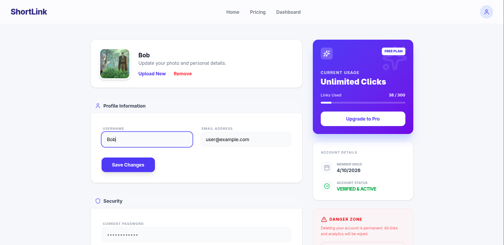

# ShortLink

ShortLink is a high-performance, full-stack URL shortening platform. It offers instant, secure link shortening with advanced features for authenticated users, including custom aliases, expiration dates, deep analytics, and rate-limiting. Built for speed, the redirection engine leverages Redis caching to ensure sub-100ms response times.

---

## Features

### Public (Guest) Features
* **Instant Shortening:** Create short URLs on the fly without an account.
* **QR Code Generation:** Automatically generate scannable QR codes for your links.
* **Expiration Dates:** Set links to expire automatically.
* **Track This Link:** One-click option to Create account to save & track your created link.

---

### Authenticated User Features
* **Custom Aliases (Vanity URLs):** Personalize your short links (e.g., `short.link/my-campaign`).
* **Centralized Dashboard:** Manage, edit, and delete your active and expired links.
* **Advanced Analytics:** Track link performance in real-time.
    * Total and daily click tracking.
    * Geographic data (Countries).
    * Device, Browser, and Operating System breakdowns.
    * Referrer tracking.
* **Profile Management:** Update personal details, manage avatars, and handle account security.

### Core Infrastructure & Security
* **Lightning-Fast Redirects:** Redis caching layer ensures minimal latency on the critical redirect path.
* **Robust Authentication:** Secure JWT-based auth with HTTP-only refresh cookies and token blacklisting.
* **Rate Limiting:** User + IP-based request limiting (via SlowAPI & Redis) to prevent abuse and brute-force attacks.
* **Structured Logging:** Comprehensive request and error tracking using `structlog`.

---

## Tech Stack

### Backend
* **Framework:** FastAPI 
* **Database:** PostgreSQL with SQLAlchemy (Async) & Alembic (Migrations)
* **Caching & Rate Limiting:** Redis & SlowAPI
* **Authentication:** JWT (`python-jose`) & Password Hashing (`argon2-cffi`)
* **Analytics Engine:** `geoip2` (IP Geolocation) & `user-agents` (Device parsing)
* **Package Management:** `uv`

### Frontend
* **Framework:** React with TypeScript
* **Build Tool:** Vite
* **Styling:** Tailwind CSS
* **Package Management:** `pnpm`

---

## Screenshots

| Landing Page | Dashboard View |
|:---:|:---:|
|  |  |

| Detailed Analytics | User Profile |
|:---:|:---:|
|  |  |

---

## Architecture Flow

### 1. URL Shortening Process
1.  **Validation:** Ensure the input URL is a valid HTTP/HTTPS address.
2.  **Generation:** Generate a unique short code (Base62 / hashids) or validate the requested custom alias.
3.  **Storage:** Save the original URL, short code, timestamps, and expiration logic to PostgreSQL.
4.  **Response:** Return the short URL and QR code data to the client.

### 2. Redirect Flow (The Critical Path)
*Optimized for < 100ms response times.*
1.  **Request:** User hits `example.com/{code}`.
2.  **Cache Check (Redis):** * *Hit:* Retrieve the original URL immediately.
    * *Miss:* Query PostgreSQL, cache the result in Redis with an appropriate TTL, and return the URL.
3.  **Analytics (Background Task):** Asynchronously log the click, IP address, User-Agent, and referrer to the DB without blocking the redirect.
4.  **Redirect:** Issue a `307 Temporary Redirect` to the destination.

---

## License
This project is licensed under the MIT License.
